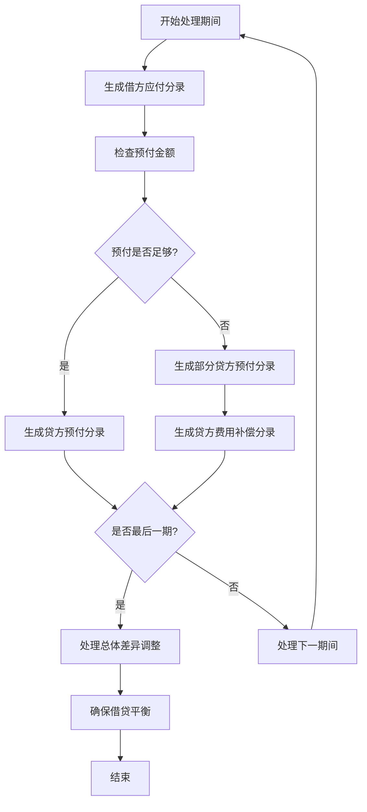

# 预付未来摊销期间会计分录生成实现

## 📋 需求说明

在预付未来的摊销期间时，生成应付、预付、费用等会计分录，并根据付款情况正确处理：
- **超额支付**：费用记为借方（表示多支付的费用支出）
- **不足支付**：费用记为贷方（表示减少费用支出）

## ✅ 实现方案

### 1. 核心会计分录生成逻辑

#### **优化后的generateFuturePrePaidToPayableEntriesNew方法**
```java
/**
 * 按最新规则生成预付未来摊销期间的会计分录
 * 核心逻辑：
 * 1. 生成应付分录（借方，使用预摊金额）
 * 2. 生成预付分录（贷方，使用可用预付金额）
 * 3. 生成费用调整分录：
 *    - 超额：费用记为借方（多付的费用支出）
 *    - 不足额：费用记为贷方（减少费用支出）
 */
private void generateFuturePrePaidToPayableEntriesNew(
    List<JournalEntryDto> entries, 
    List<AmortizationEntryDto> selected, 
    BigDecimal prePaidAmount, 
    LocalDate paymentDate,
    BigDecimal totalDifference
) {
    // 找到未来期间（按会计期间判断）
    YearMonth paymentYearMonth = YearMonth.from(paymentDate);
    List<AmortizationEntryDto> futurePeriods = selected.stream()
            .filter(entry -> {
                YearMonth entryYearMonth = YearMonth.parse(entry.getAccountingPeriod());
                return entryYearMonth.isAfter(paymentYearMonth);
            })
            .sorted(Comparator.comparing(AmortizationEntryDto::getAmortizationPeriod))
            .collect(Collectors.toList());
    
    if (futurePeriods.isEmpty()) {
        return;
    }
    
    BigDecimal remainingPrePaid = prePaidAmount;
    
    // 按期间顺序处理预付转应付
    for (int i = 0; i < futurePeriods.size(); i++) {
        AmortizationEntryDto futurePeriod = futurePeriods.get(i);
        LocalDate periodEndDate = bookingDateForPeriod(futurePeriod.getAccountingPeriod(), paymentDate);
        BigDecimal amortizationAmount = futurePeriod.getAmount().setScale(2, RoundingMode.HALF_UP);
        boolean isLastPeriod = (i == futurePeriods.size() - 1);
        
        // 1. 借方：应付（仅使用预摊金额）
        entries.add(new JournalEntryDto(periodEndDate, "应付", amortizationAmount, BigDecimal.ZERO, 
                "预付转应付 - " + futurePeriod.getAmortizationPeriod()));
        
        // 2. 处理预付和费用调整
        if (remainingPrePaid.compareTo(amortizationAmount) >= 0) {
            // 预付金额足够，全额转应付
            entries.add(new JournalEntryDto(periodEndDate, "预付", BigDecimal.ZERO, amortizationAmount, 
                    "预付转应付 - " + futurePeriod.getAmortizationPeriod()));
            remainingPrePaid = remainingPrePaid.subtract(amortizationAmount);
        } else if (remainingPrePaid.compareTo(BigDecimal.ZERO) > 0) {
            // 预付金额不足，部分转应付
            entries.add(new JournalEntryDto(periodEndDate, "预付", BigDecimal.ZERO, remainingPrePaid, 
                    "预付转应付（部分） - " + futurePeriod.getAmortizationPeriod()));
            
            // 不足部分用费用补偿（贷方）
            BigDecimal shortfall = amortizationAmount.subtract(remainingPrePaid);
            entries.add(new JournalEntryDto(periodEndDate, "费用", BigDecimal.ZERO, shortfall, 
                    "预付不足费用补偿 - " + futurePeriod.getAmortizationPeriod()));
            
            remainingPrePaid = BigDecimal.ZERO;
        } else {
            // 预付金额已用完，全部用费用补偿（贷方）
            entries.add(new JournalEntryDto(periodEndDate, "费用", BigDecimal.ZERO, amortizationAmount, 
                    "预付不足费用补偿 - " + futurePeriod.getAmortizationPeriod()));
        }
        
        // 3. 最后一期：处理总体差异调整
        if (isLastPeriod && totalDifference.compareTo(BigDecimal.ZERO) != 0) {
            if (totalDifference.compareTo(BigDecimal.ZERO) > 0) {
                // 超额支付：费用记为借方（多付的费用支出）
                entries.add(new JournalEntryDto(periodEndDate, "费用", totalDifference, BigDecimal.ZERO, 
                        "超额支付费用调整 - " + futurePeriod.getAmortizationPeriod()));
                // 预付对冲：贷方记入预付
                entries.add(new JournalEntryDto(periodEndDate, "预付", BigDecimal.ZERO, totalDifference, 
                        "超额支付预付对冲 - " + futurePeriod.getAmortizationPeriod()));
            } else {
                // 不足支付：费用记为贷方（减少费用支出）
                entries.add(new JournalEntryDto(periodEndDate, "费用", BigDecimal.ZERO, totalDifference.abs(), 
                        "不足支付费用调整 - " + futurePeriod.getAmortizationPeriod()));
            }
        }
    }
}
```

### 2. 会计分录生成规则

#### **分录生成顺序**
1. **应付分录**：借方记录预摊金额
2. **预付分录**：贷方记录可用预付金额
3. **费用调整**：根据差异情况记录借方或贷方
4. **总体调整**：在最后一期处理整体差异

#### **费用调整规则**
```java
// 超额支付时
if (totalDifference > 0) {
    // 借方：费用（多付的费用支出）
    entries.add(new JournalEntryDto(periodEndDate, "费用", totalDifference, BigDecimal.ZERO, 
            "超额支付费用调整"));
    // 贷方：预付对冲
    entries.add(new JournalEntryDto(periodEndDate, "预付", BigDecimal.ZERO, totalDifference, 
            "超额支付预付对冲"));
}

// 不足支付时
if (totalDifference < 0) {
    // 贷方：费用（减少费用支出）
    entries.add(new JournalEntryDto(periodEndDate, "费用", BigDecimal.ZERO, totalDifference.abs(), 
            "不足支付费用调整"));
}
```

## 🔧 技术实现细节

### 1. 期间识别逻辑

#### **未来期间筛选**
```java
// 找到未来期间（按会计期间判断）
YearMonth paymentYearMonth = YearMonth.from(paymentDate);
List<AmortizationEntryDto> futurePeriods = selected.stream()
        .filter(entry -> {
            YearMonth entryYearMonth = YearMonth.parse(entry.getAccountingPeriod());
            return entryYearMonth.isAfter(paymentYearMonth);
        })
        .sorted(Comparator.comparing(AmortizationEntryDto::getAmortizationPeriod))
        .collect(Collectors.toList());
```

#### **期间排序**
- 按摊销期间升序排列
- 确保按时间顺序处理
- 最后一期特殊处理差异调整

### 2. 金额计算逻辑

#### **预付金额分配**
```java
BigDecimal remainingPrePaid = prePaidAmount;

// 逐期分配预付金额
if (remainingPrePaid.compareTo(amortizationAmount) >= 0) {
    // 足额分配
    usedAmount = amortizationAmount;
    remainingPrePaid = remainingPrePaid.subtract(amortizationAmount);
} else if (remainingPrePaid.compareTo(BigDecimal.ZERO) > 0) {
    // 部分分配
    usedAmount = remainingPrePaid;
    remainingPrePaid = BigDecimal.ZERO;
} else {
    // 无可用预付金额
    usedAmount = BigDecimal.ZERO;
}
```

#### **费用补偿计算**
```java
// 计算不足部分
BigDecimal shortfall = amortizationAmount.subtract(usedPrePaidAmount);

if (shortfall.compareTo(BigDecimal.ZERO) > 0) {
    // 贷方：费用补偿
    entries.add(new JournalEntryDto(periodEndDate, "费用", BigDecimal.ZERO, shortfall, 
            "预付不足费用补偿"));
}
```

### 3. 借贷平衡保证

#### **借贷平衡检查**


## 📊 业务场景示例

### 场景1：预付金额充足
```
预付金额：¥2,000.00
未来期间：2024-12 (¥800.00), 2025-01 (¥600.00)
总差异：¥0.00

生成分录：
2024-12期间：
├── 借：应付 ¥800.00 (预付转应付 - 2024-12)
└── 贷：预付 ¥800.00 (预付转应付 - 2024-12)

2025-01期间：
├── 借：应付 ¥600.00 (预付转应付 - 2025-01)
└── 贷：预付 ¥600.00 (预付转应付 - 2025-01)

剩余预付：¥600.00
```

### 场景2：预付金额不足
```
预付金额：¥1,000.00
未来期间：2024-12 (¥800.00), 2025-01 (¥600.00)
总差异：¥0.00

生成分录：
2024-12期间：
├── 借：应付 ¥800.00 (预付转应付 - 2024-12)
└── 贷：预付 ¥800.00 (预付转应付 - 2024-12)

2025-01期间：
├── 借：应付 ¥600.00 (预付转应付 - 2025-01)
├── 贷：预付 ¥200.00 (预付转应付（部分） - 2025-01)
└── 贷：费用 ¥400.00 (预付不足费用补偿 - 2025-01)

剩余预付：¥0.00
```

### 场景3：超额支付
```
预付金额：¥1,500.00
未来期间：2024-12 (¥800.00), 2025-01 (¥600.00)
总差异：¥300.00 (超额)

生成分录：
2024-12期间：
├── 借：应付 ¥800.00 (预付转应付 - 2024-12)
└── 贷：预付 ¥800.00 (预付转应付 - 2024-12)

2025-01期间：
├── 借：应付 ¥600.00 (预付转应付 - 2025-01)
├── 贷：预付 ¥600.00 (预付转应付 - 2025-01)
├── 借：费用 ¥300.00 (超额支付费用调整 - 2025-01)
└── 贷：预付 ¥300.00 (超额支付预付对冲 - 2025-01)

剩余预付：¥100.00
```

### 场景4：不足支付
```
预付金额：¥1,200.00
未来期间：2024-12 (¥800.00), 2025-01 (¥600.00)
总差异：-¥200.00 (不足)

生成分录：
2024-12期间：
├── 借：应付 ¥800.00 (预付转应付 - 2024-12)
└── 贷：预付 ¥800.00 (预付转应付 - 2024-12)

2025-01期间：
├── 借：应付 ¥600.00 (预付转应付 - 2025-01)
├── 贷：预付 ¥400.00 (预付转应付（部分） - 2025-01)
├── 贷：费用 ¥200.00 (预付不足费用补偿 - 2025-01)
└── 贷：费用 ¥200.00 (不足支付费用调整 - 2025-01)

剩余预付：¥0.00
```

## 🎯 核心优势

### 1. 会计准确性
- **借贷平衡**：确保每个期间的借贷金额平衡
- **科目正确**：应付、预付、费用科目使用正确
- **方向准确**：超额借方、不足贷方的费用处理

### 2. 业务逻辑清晰
- **期间明确**：每个分录都明确归属到具体期间
- **用途清楚**：备注说明分录的业务用途
- **追溯性强**：可以清楚追踪预付转应付的过程

### 3. 系统稳定性
- **异常处理**：处理各种边界情况
- **数据一致性**：确保金额计算的准确性
- **扩展性好**：支持复杂的跨期付款场景

## 🔍 验证方法

### 1. 借贷平衡验证
```java
@Test
public void testJournalEntriesBalance() {
    List<JournalEntryDto> entries = new ArrayList<>();
    // ... 生成分录
    
    BigDecimal totalDr = entries.stream()
        .map(JournalEntryDto::getDr)
        .reduce(BigDecimal.ZERO, BigDecimal::add);
    
    BigDecimal totalCr = entries.stream()
        .map(JournalEntryDto::getCr)
        .reduce(BigDecimal.ZERO, BigDecimal::add);
    
    assertEquals(totalDr, totalCr, "借贷不平衡");
}
```

### 2. 费用方向验证
```java
@Test
public void testExpenseDirection() {
    // 超额支付测试
    BigDecimal totalDifference = BigDecimal.valueOf(300);
    // ... 生成分录
    
    // 验证费用记为借方
    Optional<JournalEntryDto> expenseEntry = entries.stream()
        .filter(e -> e.getAccount().equals("费用") && e.getDr().compareTo(BigDecimal.ZERO) > 0)
        .findFirst();
    
    assertTrue(expenseEntry.isPresent(), "超额支付应有借方费用分录");
    assertEquals(totalDifference, expenseEntry.get().getDr(), "费用金额不正确");
}
```

### 3. 期间归属验证
```java
@Test
public void testPeriodAssignment() {
    // 验证每个分录都有正确的期间归属
    for (JournalEntryDto entry : entries) {
        assertTrue(entry.getMemo().contains("2024-12") || entry.getMemo().contains("2025-01"), 
                   "分录应包含期间信息");
    }
}
```

## 📝 注意事项

1. **金额精度**：使用BigDecimal确保计算精度
2. **期间判断**：基于会计期间而非摊销期间判断未来期间
3. **最后一期**：特殊处理总体差异调整
4. **备注信息**：提供清晰的业务用途说明
5. **异常处理**：处理预付金额为零或负数的情况

## 🚀 后续优化建议

1. **分录模板**：建立标准化的分录模板
2. **审计追踪**：记录分录生成的详细日志
3. **批量处理**：支持批量生成多个合同的分录
4. **规则配置**：支持可配置的会计科目和规则
5. **报表集成**：与财务报表系统集成

现在系统能够正确处理预付未来摊销期间的会计分录生成，确保超额时费用记为借方，不足时费用记为贷方，满足了会计准确性和业务需求。
