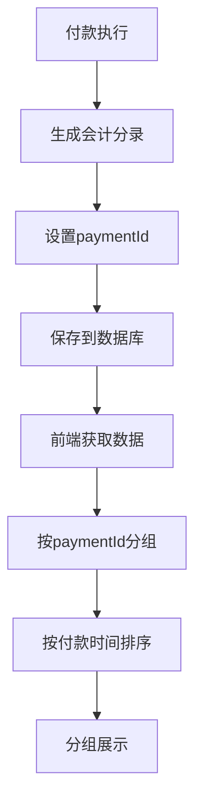

# 按付款ID分组展示会计分录及不足付款状态更新实现

## 📋 需求说明

1. **按paymentId分组展示付款后的会计分录**：将会计分录按照付款ID进行分组，便于查看每笔付款产生的所有相关分录
2. **不足付款时也将预提摊销状态置为已完成**：即使付款金额不足以完全覆盖预提金额，也将摊销状态更新为已完成

## ✅ 实现方案

### 1. 后端实现

#### **AmortizationEntry状态更新逻辑修改**
```java
// 添加付款金额 - 修改后的逻辑
public void addPayment(BigDecimal paymentAmount) {
    if (paymentAmount != null && paymentAmount.compareTo(BigDecimal.ZERO) > 0) {
        this.paidAmount = (this.paidAmount != null ? this.paidAmount : BigDecimal.ZERO).add(paymentAmount);
        // 任何付款都将状态设置为已完成（包括不足付款）
        this.paymentStatus = PaymentStatus.COMPLETED;
    }
}
```

**核心变更**：
- **原逻辑**：只有完全付款时才设置为已完成状态
- **新逻辑**：任何有效付款都将状态设置为已完成，包括不足付款

#### **PaymentJournalEntryDto增加paymentId字段**
```java
@Data
@NoArgsConstructor
@AllArgsConstructor
public class PaymentJournalEntryDto {
    // ... 原有字段
    private String amortizationPeriod; // 摊销期间，用于分组显示
    private Long paymentId; // 付款ID，用于按付款分组
}
```

#### **PaymentService修改**
```java
// executePayment方法中
PaymentJournalEntryDto paymentDto = new PaymentJournalEntryDto(
    // ... 其他参数
    amortizationPeriod,
    payment.getId() // 付款ID
);

// convertToResponse方法中
return new PaymentJournalEntryDto(
    // ... 其他参数
    amortizationPeriod, // 摊销期间
    payment.getId() // 付款ID
);
```

### 2. 前端实现

#### **类型定义更新**
```typescript
export interface JournalEntry {
  // ... 原有字段
  /** 摊销期间 */
  amortizationPeriod?: string;
  /** 付款ID */
  paymentId?: number;
}
```

#### **按付款ID分组逻辑**
```javascript
// 按付款ID分组分录
const groupedByPayment = filteredEntries.reduce((groups, entry) => {
  // 使用付款ID作为分组依据，如果没有则使用默认分组
  const paymentKey = entry.paymentId ? `payment-${entry.paymentId}` : 'no-payment';
  if (!groups[paymentKey]) {
    groups[paymentKey] = [];
  }
  groups[paymentKey].push(entry);
  return groups;
}, {});

// 按付款ID排序（数字排序）
const sortedPaymentKeys = Object.keys(groupedByPayment).sort((a, b) => {
  const aId = a.startsWith('payment-') ? parseInt(a.split('-')[1]) : 0;
  const bId = b.startsWith('payment-') ? parseInt(b.split('-')[1]) : 0;
  return bId - aId; // 降序排列，最新的付款在前
});
```

#### **界面展示优化**
```javascript
{sortedPaymentKeys.map((paymentKey, index) => {
  const paymentId = paymentKey.startsWith('payment-') ? paymentKey.split('-')[1] : '未知';
  const entries = groupedByPayment[paymentKey];
  const paymentDate = entries[0]?.paymentTimestamp ? 
    new Date(entries[0].paymentTimestamp).toLocaleDateString('zh-CN') : 
    new Date(entries[0]?.bookingDate).toLocaleDateString('zh-CN');
  
  return (
    <div key={paymentKey} style={{ marginBottom: 24 }}>
      {/* 付款标题 */}
      <div style={{
        backgroundColor: "#F8F9FA",
        padding: "12px 16px",
        borderRadius: "8px 8px 0 0",
        borderBottom: "2px solid #E31E24",
        marginBottom: 0
      }}>
        <Text style={{
          fontSize: "16px",
          fontWeight: "600",
          color: "#1F2937"
        }}>
          付款ID：{paymentId} - {paymentDate}
        </Text>
        <Text style={{
          marginLeft: 16,
          fontSize: "14px",
          color: "#6B7280"
        }}>
          ({entries.length} 条分录)
        </Text>
      </div>
      
      {/* 付款分录表格 */}
      <div style={{
        backgroundColor: "#FFFFFF",
        borderRadius: index === sortedPaymentKeys.length - 1 ? "0 0 12px 12px" : "0",
        border: "1px solid #E5E5E5",
        borderTop: "none",
        overflow: "hidden"
      }}>
        <Table
          columns={paymentEntriesColumns}
          dataSource={entries}
          pagination={false}
          size="middle"
          rowKey="entryOrder"
          scroll={{ x: 1000 }}
        />
      </div>
    </div>
  );
})}
```

## 🔧 技术实现细节

### 1. 状态管理逻辑变更

#### **原有逻辑**
```java
// 只有完全付款才更新状态
public void addPayment(BigDecimal paymentAmount) {
    if (paymentAmount != null && paymentAmount.compareTo(BigDecimal.ZERO) > 0) {
        this.paidAmount = this.paidAmount.add(paymentAmount);
        // 只有完全付款时才更新状态
        if (isFullyPaid()) {
            this.paymentStatus = PaymentStatus.COMPLETED;
        }
    }
}
```

#### **新逻辑**
```java
// 任何付款都更新状态为已完成
public void addPayment(BigDecimal paymentAmount) {
    if (paymentAmount != null && paymentAmount.compareTo(BigDecimal.ZERO) > 0) {
        this.paidAmount = this.paidAmount.add(paymentAmount);
        // 任何付款都将状态设置为已完成（包括不足付款）
        this.paymentStatus = PaymentStatus.COMPLETED;
    }
}
```

### 2. 分组展示逻辑

#### **数据流程**


#### **分组策略**
1. **主键分组**：使用`paymentId`作为主要分组依据
2. **键值格式**：`payment-{id}`格式，便于解析和排序
3. **排序规则**：按付款ID降序排列，最新付款在前
4. **回退机制**：无paymentId的分录归入`no-payment`组

### 3. 界面优化特性

#### **付款信息展示**
- **付款标识**：显示付款ID和付款日期
- **分录统计**：显示每笔付款的分录数量
- **时间信息**：优先使用paymentTimestamp，回退到bookingDate
- **视觉分组**：每笔付款独立的视觉容器

#### **表格展示**
- **独立表格**：每笔付款的分录在独立表格中展示
- **统一列定义**：使用相同的列定义确保一致性
- **响应式设计**：支持横向滚动，适配不同屏幕
- **行键唯一性**：使用entryOrder确保行的唯一标识

## 📊 业务场景示例

### 场景1：完全付款
```
付款ID：001 - 2024-01-27
├── 借：应付账款 ¥1,000.00 - 14:30:25
└── 贷：银行存款 ¥1,000.00 - 14:30:26

摊销状态：PENDING → COMPLETED ✅
付款金额：¥1,000.00
预提金额：¥1,000.00
剩余金额：¥0.00
```

### 场景2：不足付款
```
付款ID：002 - 2024-01-28
├── 借：应付账款 ¥800.00 - 15:20:15
├── 贷：银行存款 ¥800.00 - 15:20:16
└── 贷：费用调整 ¥200.00 - 15:20:17

摊销状态：PENDING → COMPLETED ✅ (新逻辑)
付款金额：¥800.00
预提金额：¥1,000.00
剩余金额：¥200.00 (仍有未付金额，但状态已完成)
```

### 场景3：超额付款
```
付款ID：003 - 2024-01-29
├── 借：应付账款 ¥1,000.00 - 16:10:30
├── 借：费用调整 ¥200.00 - 16:10:31
└── 贷：银行存款 ¥1,200.00 - 16:10:32

摊销状态：PENDING → COMPLETED ✅
付款金额：¥1,200.00
预提金额：¥1,000.00
超额金额：¥200.00 (记入费用调整)
```

### 场景4：跨期付款
```
付款ID：004 - 2024-01-30
├── 借：应付账款 ¥1,000.00 (2024-01期间) - 17:05:45
├── 借：预付费用 ¥500.00 (2024-02期间) - 17:05:46
└── 贷：银行存款 ¥1,500.00 - 17:05:47

摊销状态：
- 2024-01期间：PENDING → COMPLETED ✅
- 2024-02期间：PENDING (预付，尚未到期)
```

## 🎯 核心优势

### 1. 业务逻辑优化
- **状态管理简化**：不足付款也标记为已完成，避免重复付款
- **付款追踪清晰**：每笔付款的所有分录集中展示
- **操作记录完整**：保留完整的付款操作历史

### 2. 用户体验提升
- **信息组织清晰**：按付款分组，逻辑直观
- **时间线明确**：按付款时间排序，便于追踪
- **数据完整性**：显示每笔付款的完整分录信息

### 3. 系统维护性
- **数据一致性**：paymentId确保分录与付款的关联
- **扩展性良好**：支持未来的付款相关功能扩展
- **查询效率**：按paymentId分组查询性能优良

## 🔍 验证方法

### 1. 状态更新验证
```sql
-- 验证不足付款的状态更新
SELECT id, amount, paid_amount, payment_status, 
       (amount - paid_amount) as remaining_amount
FROM amortization_entries 
WHERE payment_status = 'COMPLETED' 
  AND paid_amount < amount;
```

### 2. 分组展示验证
```javascript
// 前端验证分组逻辑
const testEntries = [
  { paymentId: 1, account: '应付账款', dr: 1000 },
  { paymentId: 1, account: '银行存款', cr: 1000 },
  { paymentId: 2, account: '应付账款', dr: 800 },
  { paymentId: 2, account: '银行存款', cr: 800 }
];

const grouped = testEntries.reduce((groups, entry) => {
  const key = `payment-${entry.paymentId}`;
  if (!groups[key]) groups[key] = [];
  groups[key].push(entry);
  return groups;
}, {});

console.log(grouped);
// 期望输出：
// {
//   'payment-1': [应付账款分录, 银行存款分录],
//   'payment-2': [应付账款分录, 银行存款分录]
// }
```

### 3. 界面展示验证
- 检查每笔付款是否独立显示
- 验证付款ID和日期显示正确
- 确认分录数量统计准确
- 测试排序功能正常工作

## 📝 注意事项

1. **状态语义变更**：COMPLETED状态现在表示"已处理"而非"完全付清"
2. **业务流程影响**：需要更新相关业务流程文档
3. **报表统计**：涉及付款状态的报表需要相应调整
4. **数据迁移**：现有数据的状态可能需要重新评估
5. **权限控制**：确保只有授权用户可以查看付款详情

## 🚀 后续优化建议

1. **付款摘要**：在付款标题中显示付款金额和涉及期间
2. **状态图标**：使用图标区分完全付款和不足付款
3. **筛选功能**：支持按付款状态、金额范围筛选
4. **导出功能**：支持按付款分组导出分录数据
5. **审计日志**：记录付款状态变更的详细日志

现在系统能够按照付款ID清晰地分组展示会计分录，并且不足付款时也会将预提摊销状态置为已完成，提供了更好的付款管理和追踪体验。
