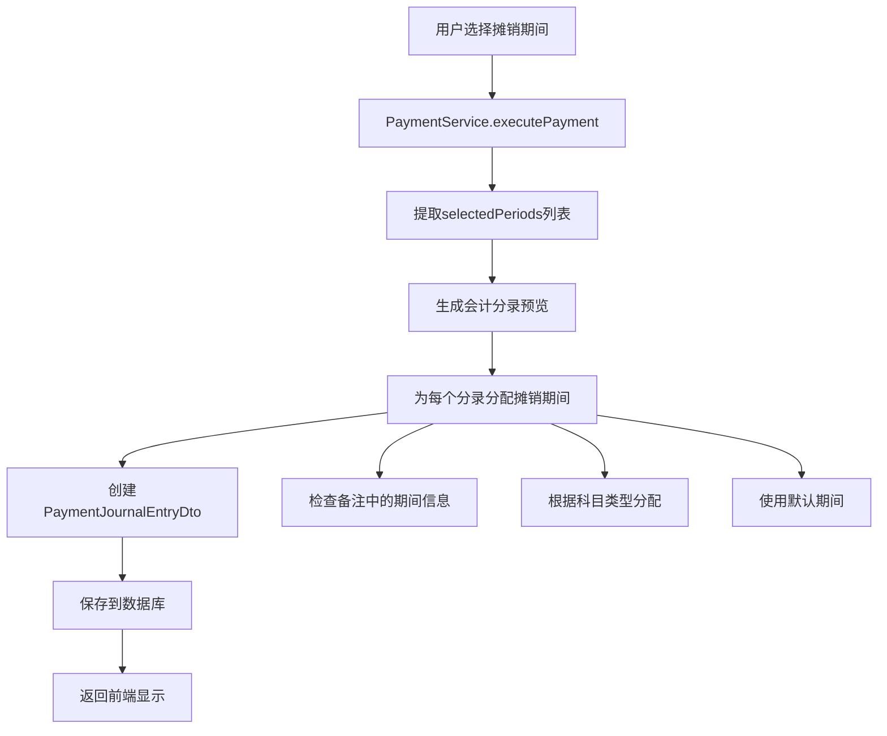

# 根据选中会计期间分配分录分组实现

## 📋 需求说明

提交支付时，根据支付明细表中选中的会计期间作为分组依据，确保会计分录能够正确归属到对应的摊销期间。

## ✅ 实现方案

### 1. 智能期间分配算法

#### **核心分配逻辑**
```java
/**
 * 根据分录类型和内容分配摊销期间
 */
private String assignAmortizationPeriod(JournalEntryDto dto, List<String> selectedPeriods) {
    if (selectedPeriods == null || selectedPeriods.isEmpty()) {
        return null;
    }
    
    // 第一优先级：从备注中提取期间信息（格式：yyyy-MM）
    if (dto.getMemo() != null) {
        Pattern pattern = Pattern.compile("(\\d{4}-\\d{2})");
        Matcher matcher = pattern.matcher(dto.getMemo());
        
        if (matcher.find()) {
            String extractedPeriod = matcher.group(1);
            // 验证提取的期间是否在选中的期间列表中
            if (selectedPeriods.contains(extractedPeriod)) {
                return extractedPeriod;
            }
        }
    }
    
    // 第二优先级：根据会计科目类型分配期间
    String account = dto.getAccount();
    if (account != null) {
        // 应付科目：使用当期（第一个选中期间）
        if (account.contains("应付") || account.contains("Payable")) {
            return selectedPeriods.get(0);
        }
        // 预付科目：如果是跨期付款，使用未来期间
        else if (account.contains("预付") || account.contains("Prepaid")) {
            return selectedPeriods.size() > 1 ? 
                   selectedPeriods.get(selectedPeriods.size() - 1) : 
                   selectedPeriods.get(0);
        }
        // 费用调整：使用最后一个期间
        else if (account.contains("费用") || account.contains("Expense")) {
            return selectedPeriods.get(selectedPeriods.size() - 1);
        }
        // 银行存款等：使用当期
        else {
            return selectedPeriods.get(0);
        }
    }
    
    // 默认使用第一个选中的期间
    return selectedPeriods.get(0);
}
```

### 2. 期间分配规则

#### **分配优先级**
1. **第一优先级**：备注中明确的期间信息（yyyy-MM格式）
2. **第二优先级**：根据会计科目类型的业务逻辑分配
3. **第三优先级**：默认使用第一个选中期间

#### **科目类型分配规则**
```java
// 应付科目 → 当期（第一个选中期间）
应付账款、应付费用 → selectedPeriods.get(0)

// 预付科目 → 未来期间（最后一个选中期间）
预付费用、预付账款 → selectedPeriods.get(selectedPeriods.size() - 1)

// 费用调整 → 最后期间（用于差异调整）
费用调整、管理费用 → selectedPeriods.get(selectedPeriods.size() - 1)

// 资金科目 → 当期（实际付款期间）
银行存款、现金 → selectedPeriods.get(0)
```

### 3. 数据流程实现

#### **付款执行流程**


#### **期间分配示例**
```java
// 示例：用户选择2024-11, 2024-12两个期间
List<String> selectedPeriods = Arrays.asList("2024-11", "2024-12");

// 分录1：应付账款 1000.00（备注：2024-11期间预提费用）
// 分配结果：2024-11（从备注提取）

// 分录2：预付费用 200.00（备注：跨期付款预付）
// 分配结果：2024-12（预付科目，使用未来期间）

// 分录3：银行存款 1200.00（备注：实际付款）
// 分配结果：2024-11（资金科目，使用当期）

// 分录4：费用调整 200.00（备注：超额支付调整）
// 分配结果：2024-12（费用调整，使用最后期间）
```

## 🔧 技术实现细节

### 1. 后端实现

#### **PaymentService修改**
```java
// 在executePayment方法中
for (int i = 0; i < previewResponse.getEntries().size(); i++) {
    JournalEntryDto dto = previewResponse.getEntries().get(i);
    
    // 根据分录类型和备注内容分配摊销期间
    String amortizationPeriod = assignAmortizationPeriod(dto, periodStrings);
    
    PaymentJournalEntryDto paymentDto = new PaymentJournalEntryDto(
        // ... 其他字段
        amortizationPeriod // 分配的摊销期间
    );
}
```

#### **convertToResponse方法**
```java
// 处理已保存的分录
List<PaymentJournalEntryDto> entryDtos = entries.stream()
    .map(e -> {
        // 创建临时DTO用于期间分配
        JournalEntryDto tempDto = new JournalEntryDto(
            e.getBookingDate(), e.getAccountName(), 
            e.getDebitAmount(), e.getCreditAmount(), e.getMemo()
        );
        String amortizationPeriod = assignAmortizationPeriod(tempDto, selectedPeriods);
        
        return new PaymentJournalEntryDto(
            // ... 其他字段
            amortizationPeriod
        );
    })
    .collect(Collectors.toList());
```

### 2. 前端分组逻辑

#### **优化后的分组代码**
```javascript
// 按预提摊销期间分组分录
const groupedByPeriod = filteredEntries.reduce((groups, entry) => {
  // 优先使用后端分配的摊销期间信息
  const period = entry.amortizationPeriod || 
                entry.memo?.match(/(\d{4}-\d{2})/)?.[1] || 
                new Date(entry.bookingDate).toISOString().slice(0, 7);
  if (!groups[period]) {
    groups[period] = [];
  }
  groups[period].push(entry);
  return groups;
}, {});
```

## 📊 业务场景示例

### 场景1：单期间付款
```
用户选择：2024-11
付款金额：1000.00
生成分录：
1. 借：应付账款 1000.00 → 分配到2024-11
2. 贷：银行存款 1000.00 → 分配到2024-11

前端显示：
摊销期间：2024-11 (2 条分录)
├── 应付账款 借方 ¥1,000.00
└── 银行存款 贷方 ¥1,000.00
```

### 场景2：跨期间付款
```
用户选择：2024-11, 2024-12
付款金额：1500.00
预提金额：1000.00 (2024-11), 300.00 (2024-12)
生成分录：
1. 借：应付账款 1000.00 (备注：2024-11) → 分配到2024-11
2. 借：应付账款 300.00 (备注：2024-12) → 分配到2024-12
3. 借：费用调整 200.00 → 分配到2024-12（最后期间）
4. 贷：银行存款 1500.00 → 分配到2024-11（当期）

前端显示：
摊销期间：2024-11 (2 条分录)
├── 应付账款 借方 ¥1,000.00
└── 银行存款 贷方 ¥1,500.00

摊销期间：2024-12 (2 条分录)
├── 应付账款 借方 ¥300.00
└── 费用调整 借方 ¥200.00
```

### 场景3：复杂跨期付款
```
用户选择：2024-11, 2024-12, 2025-01
付款金额：2000.00
预提金额：1000.00 (2024-11), 500.00 (2024-12)
生成分录：
1. 借：应付账款 1000.00 (备注：2024-11) → 分配到2024-11
2. 借：应付账款 500.00 (备注：2024-12) → 分配到2024-12
3. 借：预付费用 500.00 (备注：2025-01) → 分配到2025-01
4. 贷：银行存款 2000.00 → 分配到2024-11（当期）

前端显示：
摊销期间：2024-11 (2 条分录)
├── 应付账款 借方 ¥1,000.00
└── 银行存款 贷方 ¥2,000.00

摊销期间：2024-12 (1 条分录)
└── 应付账款 借方 ¥500.00

摊销期间：2025-01 (1 条分录)
└── 预付费用 借方 ¥500.00
```

## 🎯 核心优势

### 1. 业务逻辑准确
- **期间归属明确**：每个分录都有明确的业务期间归属
- **科目分类合理**：根据会计科目性质进行智能分配
- **跨期处理正确**：支持复杂的跨期付款场景

### 2. 数据一致性强
- **验证机制**：确保提取的期间在选中列表中
- **回退策略**：多级回退确保每个分录都有期间归属
- **业务规则**：遵循会计业务逻辑进行分配

### 3. 用户体验优化
- **分组清晰**：按期间分组便于理解和查看
- **信息完整**：每个期间显示相关的所有分录
- **操作便捷**：可以快速定位特定期间的业务

## 🔍 验证方法

### 1. 单元测试
```java
@Test
public void testAssignAmortizationPeriod() {
    List<String> periods = Arrays.asList("2024-11", "2024-12");
    
    // 测试应付科目
    JournalEntryDto payableDto = new JournalEntryDto(
        LocalDate.now(), "应付账款", BigDecimal.valueOf(1000), BigDecimal.ZERO, "2024-11期间"
    );
    String result = paymentService.assignAmortizationPeriod(payableDto, periods);
    assertEquals("2024-11", result);
    
    // 测试预付科目
    JournalEntryDto prepaidDto = new JournalEntryDto(
        LocalDate.now(), "预付费用", BigDecimal.valueOf(500), BigDecimal.ZERO, "跨期预付"
    );
    result = paymentService.assignAmortizationPeriod(prepaidDto, periods);
    assertEquals("2024-12", result);
}
```

### 2. 集成测试
```java
@Test
public void testPaymentExecutionWithPeriodAssignment() {
    // 创建测试数据
    PaymentExecuteRequest request = new PaymentExecuteRequest();
    request.setSelectedPeriods(Arrays.asList(1L, 2L)); // 对应2024-11, 2024-12
    request.setPaymentAmount(BigDecimal.valueOf(1500));
    
    // 执行付款
    PaymentExecuteResponse response = paymentService.executePayment(1L, request);
    
    // 验证分录期间分配
    Map<String, List<PaymentJournalEntryDto>> grouped = response.getJournalEntries()
        .stream()
        .collect(Collectors.groupingBy(PaymentJournalEntryDto::getAmortizationPeriod));
    
    assertTrue(grouped.containsKey("2024-11"));
    assertTrue(grouped.containsKey("2024-12"));
}
```

## 📝 注意事项

1. **期间格式统一**：确保所有期间都使用yyyy-MM格式
2. **科目名称标准化**：确保科目名称包含关键字用于识别
3. **备注信息完整**：在生成分录时包含期间信息到备注中
4. **数据验证**：确保选中的期间列表不为空
5. **性能考虑**：大量分录时的分配算法性能优化

现在系统能够根据用户在支付明细表中选中的会计期间，智能地为每个会计分录分配正确的摊销期间，实现了精确的期间归属和清晰的分组显示。
