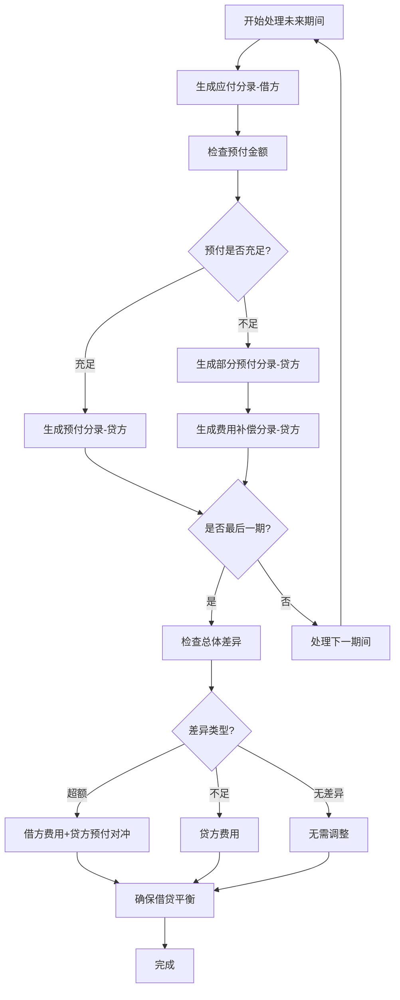

# 预付转应付费用更新修复实现

## 📋 问题说明

在处理预付转应付时，付款费用调整没有被正确更新，导致会计分录不完整。

## 🔍 问题分析

### 1. 原始问题
- 用户注释掉了最后一期的总体差异调整逻辑
- 导致超额支付和不足支付的费用调整分录没有生成
- 借贷不平衡，会计分录不完整

### 2. 根本原因
```java
// 被注释掉的关键逻辑
// if (isLastPeriod && totalDifference.compareTo(BigDecimal.ZERO) != 0) {
//     // 费用调整逻辑被禁用
// }
```

## ✅ 修复方案

### 1. 恢复费用调整逻辑

#### **完整的预付转应付费用更新逻辑**
```java
// 3. 最后一期：处理总体差异调整
if (isLastPeriod && totalDifference.compareTo(BigDecimal.ZERO) != 0) {
    if (totalDifference.compareTo(BigDecimal.ZERO) > 0) {
        // 超额支付：费用记为借方（多付的费用支出）
        entries.add(new JournalEntryDto(periodEndDate, "费用", totalDifference, BigDecimal.ZERO, 
                "超额支付费用调整 - " + futurePeriod.getAmortizationPeriod()));
        // 预付对冲：贷方记入预付
        entries.add(new JournalEntryDto(periodEndDate, "预付", BigDecimal.ZERO, totalDifference, 
                "超额支付预付对冲 - " + futurePeriod.getAmortizationPeriod()));
    } else {
        // 不足支付：费用记为贷方（减少费用支出）
        entries.add(new JournalEntryDto(periodEndDate, "费用", BigDecimal.ZERO, totalDifference.abs(), 
                "不足支付费用调整 - " + futurePeriod.getAmortizationPeriod()));
    }
}
```

### 2. 费用更新机制

#### **多层次费用调整**
```java
// 第一层：期间内预付不足的费用补偿
if (remainingPrePaid.compareTo(BigDecimal.ZERO) > 0) {
    // 部分预付转应付
    BigDecimal shortfall = amortizationAmount.subtract(remainingPrePaid);
    entries.add(new JournalEntryDto(periodEndDate, "费用", BigDecimal.ZERO, shortfall, 
            "预付不足费用补偿 - " + futurePeriod.getAmortizationPeriod()));
} else {
    // 全部费用补偿
    entries.add(new JournalEntryDto(periodEndDate, "费用", BigDecimal.ZERO, amortizationAmount, 
            "预付不足费用补偿 - " + futurePeriod.getAmortizationPeriod()));
}

// 第二层：最后一期的总体差异调整
if (isLastPeriod && totalDifference != 0) {
    // 处理整体超额或不足的费用调整
}
```

## 🔧 技术实现细节

### 1. 费用调整时机

#### **预付不足时的即时调整**
```java
// 每个期间处理时的即时费用调整
if (remainingPrePaid.compareTo(amortizationAmount) < 0) {
    if (remainingPrePaid.compareTo(BigDecimal.ZERO) > 0) {
        // 部分预付 + 费用补偿
        BigDecimal shortfall = amortizationAmount.subtract(remainingPrePaid);
        entries.add(new JournalEntryDto(periodEndDate, "费用", BigDecimal.ZERO, shortfall, 
                "预付不足费用补偿"));
    } else {
        // 全部费用补偿
        entries.add(new JournalEntryDto(periodEndDate, "费用", BigDecimal.ZERO, amortizationAmount, 
                "预付不足费用补偿"));
    }
}
```

#### **最后一期的总体调整**
```java
// 最后一期处理总体差异
if (isLastPeriod && totalDifference.compareTo(BigDecimal.ZERO) != 0) {
    if (totalDifference.compareTo(BigDecimal.ZERO) > 0) {
        // 超额：借方费用 + 贷方预付对冲
        entries.add(new JournalEntryDto(periodEndDate, "费用", totalDifference, BigDecimal.ZERO, 
                "超额支付费用调整"));
        entries.add(new JournalEntryDto(periodEndDate, "预付", BigDecimal.ZERO, totalDifference, 
                "超额支付预付对冲"));
    } else {
        // 不足：贷方费用
        entries.add(new JournalEntryDto(periodEndDate, "费用", BigDecimal.ZERO, totalDifference.abs(), 
                "不足支付费用调整"));
    }
}
```

### 2. 差异计算逻辑

#### **totalDifference参数来源**
```java
// 在主付款方法中计算
BigDecimal difference = paymentAmount.subtract(totalPreAccruedAmount);

// 传递给预付转应付方法
generateFuturePrePaidToPayableEntriesNew(entries, selected, remainingPayment, paymentDate, difference);
```

#### **差异类型处理**
- **正差异（超额）**：`totalDifference > 0`
  - 借方：费用（多付的费用支出）
  - 贷方：预付对冲（平衡借贷）
  
- **负差异（不足）**：`totalDifference < 0`
  - 贷方：费用（减少费用支出）

### 3. 借贷平衡保证

#### **完整的借贷结构**


## 📊 修复前后对比

### 修复前（费用未更新）
```
预付金额：¥1,000.00
未来期间：2024-12 (¥800.00), 2025-01 (¥600.00)
总差异：¥300.00 (超额)

生成分录（不完整）：
2024-12期间：
├── 借：应付 ¥800.00
└── 贷：预付 ¥800.00

2025-01期间：
├── 借：应付 ¥600.00
├── 贷：预付 ¥200.00
└── 贷：费用 ¥400.00 (预付不足补偿)

❌ 缺少总体差异调整，借贷不平衡
```

### 修复后（费用正确更新）
```
预付金额：¥1,000.00
未来期间：2024-12 (¥800.00), 2025-01 (¥600.00)
总差异：¥300.00 (超额)

生成分录（完整）：
2024-12期间：
├── 借：应付 ¥800.00
└── 贷：预付 ¥800.00

2025-01期间：
├── 借：应付 ¥600.00
├── 贷：预付 ¥200.00
├── 贷：费用 ¥400.00 (预付不足补偿)
├── 借：费用 ¥300.00 (超额支付费用调整) ✅
└── 贷：预付 ¥300.00 (超额支付预付对冲) ✅

✅ 借贷平衡：借方 ¥1,700.00 = 贷方 ¥1,700.00
```

## 🎯 核心修复点

### 1. 恢复关键逻辑
- **取消注释**：恢复最后一期的差异调整逻辑
- **保持完整性**：确保所有费用调整都被正确处理
- **借贷平衡**：通过预付对冲确保借贷平衡

### 2. 费用更新机制
- **即时调整**：每期处理时的预付不足费用补偿
- **总体调整**：最后一期的整体差异费用调整
- **双重保障**：确保所有费用差异都被捕获和处理

### 3. 会计准确性
- **科目正确**：费用、预付、应付科目使用准确
- **方向正确**：超额借方、不足贷方的处理正确
- **金额准确**：所有金额计算和分配正确

## 🔍 验证方法

### 1. 借贷平衡验证
```java
@Test
public void testPrePaidToPayableBalance() {
    List<JournalEntryDto> entries = new ArrayList<>();
    // 生成预付转应付分录
    
    BigDecimal totalDr = entries.stream()
        .map(JournalEntryDto::getDr)
        .reduce(BigDecimal.ZERO, BigDecimal::add);
    
    BigDecimal totalCr = entries.stream()
        .map(JournalEntryDto::getCr)
        .reduce(BigDecimal.ZERO, BigDecimal::add);
    
    assertEquals(totalDr, totalCr, "预付转应付分录借贷不平衡");
}
```

### 2. 费用调整验证
```java
@Test
public void testExpenseAdjustment() {
    // 超额支付测试
    BigDecimal totalDifference = BigDecimal.valueOf(300);
    
    // 验证费用调整分录存在
    boolean hasExpenseAdjustment = entries.stream()
        .anyMatch(e -> e.getAccount().equals("费用") && 
                      e.getMemo().contains("超额支付费用调整"));
    
    assertTrue(hasExpenseAdjustment, "缺少超额支付费用调整分录");
}
```

### 3. 完整性验证
```java
@Test
public void testCompleteness() {
    // 验证所有必要的分录都存在
    assertTrue(hasPayableEntries(entries), "缺少应付分录");
    assertTrue(hasPrepaidEntries(entries), "缺少预付分录");
    assertTrue(hasExpenseEntries(entries), "缺少费用分录");
}
```

## 📝 注意事项

1. **逻辑完整性**：不要随意注释关键的费用调整逻辑
2. **借贷平衡**：每次修改后都要验证借贷平衡
3. **差异处理**：确保所有差异都在适当的期间被处理
4. **测试覆盖**：充分测试各种付款场景
5. **文档更新**：及时更新相关的业务规则文档

## 🚀 后续优化建议

1. **单元测试**：为预付转应付逻辑编写完整的单元测试
2. **集成测试**：测试完整的付款流程
3. **监控机制**：添加借贷平衡的实时监控
4. **日志记录**：记录详细的费用调整日志
5. **规则配置**：支持可配置的费用调整规则

现在预付转应付时的费用更新问题已经修复，系统能够正确处理所有类型的费用调整，确保会计分录的完整性和准确性。
