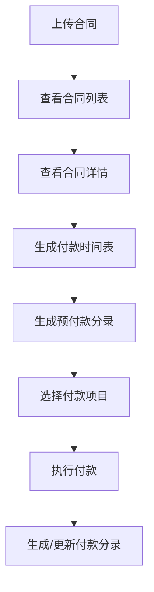

# 产品概述

## 产品简介

会计功能管理系统是一个专门用于处理合同相关会计业务的Web应用程序，主要面向财务人员和会计师使用。

## 核心功能

### 1. 合同管理
- **合同上传** - 支持用户上传合同文件
- **合同列表** - 展示所有已上传的合同信息
- **合同详情** - 查看单个合同的详细信息

### 2. 付款管理
- **付款时间表生成** - 根据合同自动生成付款计划
- **付款执行** - 用户可选择付款时间表中的项目执行付款
- **付款状态跟踪** - 实时跟踪付款进度和状态

### 3. 会计分录
- **预付款分录生成** - 自动生成合同预付款的会计分录
- **付款分录管理** - 生成和更新付款相关的会计分录
- **分录历史记录** - 保存所有会计分录的历史版本

## 用户角色

### 主要用户
- **财务专员** - 负责日常的合同和付款管理
- **会计师** - 负责会计分录的审核和管理
- **财务经理** - 负责整体财务流程的监督

## 业务流程

## 产品目标

### 短期目标
- 实现基本的合同管理功能
- 完成付款时间表的生成和管理
- 建立基础的会计分录系统

### 长期目标
- 集成更多会计系统
- 支持批量操作
- 添加报表和分析功能
- 实现移动端适配

## 成功指标

- **效率提升** - 减少50%的手工录入时间
- **准确性** - 降低90%的人为错误
- **用户满意度** - 达到85%以上的用户满意度评分
