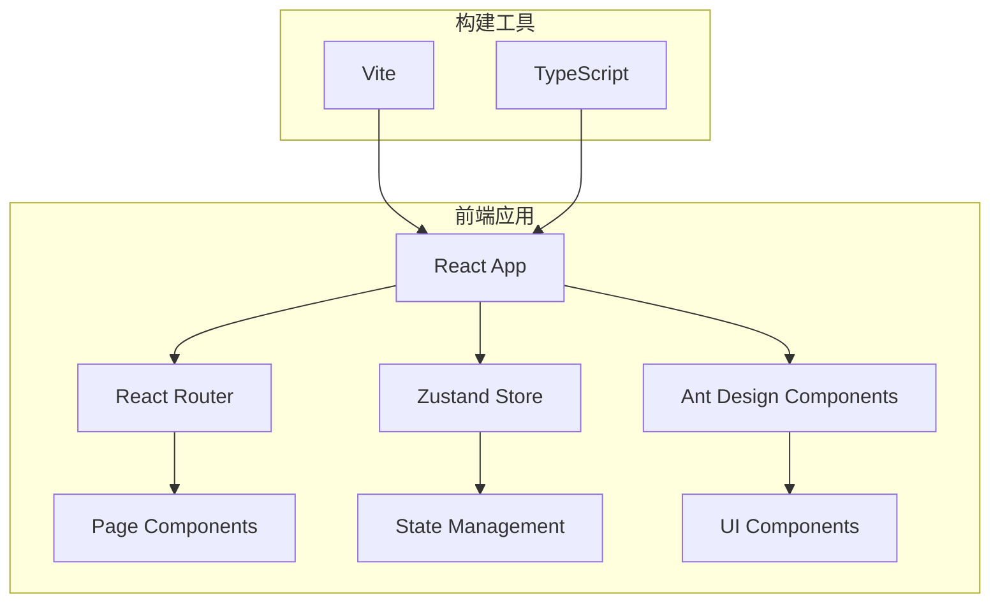

# 技术架构

## 技术栈概览

### 前端技术栈
- **React** - 前端框架，用于构建用户界面
- **TypeScript** - 类型系统，提供静态类型检查
- **Vite** - 构建工具，提供快速的开发和构建体验
- **Ant Design** - UI组件库，提供企业级的设计语言
- **React Router** - 路由管理，处理单页应用的导航
- **Zustand** - 状态管理，轻量级的状态管理解决方案

## 架构设计

### 整体架构图



### 目录结构设计

```
src/
├── components/          # 通用组件
│   ├── Layout/         # 布局组件
│   ├── Header/         # 头部组件
│   └── Common/         # 其他通用组件
├── pages/              # 页面组件
│   ├── PageA/          # 页面A
│   └── PageB/          # 页面B
├── stores/             # Zustand状态管理
│   ├── contractStore.ts
│   ├── paymentStore.ts
│   └── entryStore.ts
├── types/              # TypeScript类型定义
│   ├── contract.ts
│   ├── payment.ts
│   └── entry.ts
├── utils/              # 工具函数
├── hooks/              # 自定义Hooks
├── constants/          # 常量定义
└── styles/             # 样式文件
```

## 技术选型说明

### React
- **选择理由** - 成熟的前端框架，生态丰富，社区活跃
- **版本** - React 18+
- **特性** - 函数式组件 + Hooks

### TypeScript
- **选择理由** - 提供静态类型检查，提高代码质量和开发效率
- **配置** - 严格模式，确保类型安全

### Vite
- **选择理由** - 快速的开发服务器，优秀的构建性能
- **特性** - 热模块替换(HMR)，ES模块支持

### Ant Design
- **选择理由** - 企业级UI设计语言，组件丰富，文档完善
- **版本** - Ant Design 5.x
- **主题** - 支持自定义主题配置

### React Router
- **选择理由** - React官方推荐的路由解决方案
- **版本** - React Router v6
- **特性** - 声明式路由，嵌套路由支持

### Zustand
- **选择理由** - 轻量级状态管理，API简洁，TypeScript友好
- **特性** - 无样板代码，支持中间件

## 开发环境配置

### 必需工具
- **Node.js** - v18.0.0+
- **npm/yarn** - 包管理器
- **VS Code** - 推荐IDE

### 开发插件
- **ES7+ React/Redux/React-Native snippets**
- **TypeScript Importer**
- **Ant Design Snippets**
- **Prettier**
- **ESLint**

## 性能优化策略

### 代码分割
- 使用React.lazy()进行组件懒加载
- 路由级别的代码分割

### 状态管理优化
- 合理划分Store，避免不必要的重渲染
- 使用Zustand的selector优化性能

### 构建优化
- Vite的Tree Shaking
- 资源压缩和缓存策略

## 代码规范

### 命名规范
- **组件** - PascalCase (如: ContractList)
- **文件** - kebab-case (如: contract-list.tsx)
- **变量/函数** - camelCase (如: contractData)
- **常量** - UPPER_SNAKE_CASE (如: API_BASE_URL)

### 文件组织
- 每个组件一个文件夹
- index.ts作为导出入口
- 相关的类型定义放在同一文件夹
