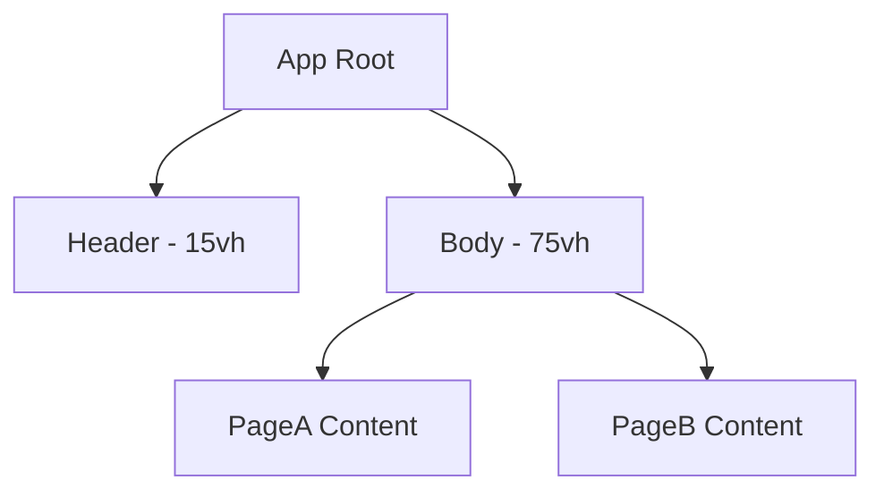

# 页面结构设计

## 整体布局架构

### 布局概览
应用采用经典的上下分层布局结构，包含固定的Header和可滚动的Body区域。



## Header 设计规范

### 视觉规范
- **背景色** - 米色 (#F5F5DC)
- **宽度** - 100vw (全屏宽度)
- **高度** - 15vh (视口高度的15%)
- **定位** - 固定定位，始终在顶部

### 内容布局
- **左侧品牌区域**
  - 文字内容："OCBC"
  - 字体颜色：#b5120f (深红色)
  - 垂直对齐：居中
  - 左边距：20px

### Ant Design 实现方案
```typescript
// 使用 Ant Design Layout 组件
import { Layout } from 'antd';
const { Header } = Layout;

// Header 样式配置
const headerStyle = {
  backgroundColor: '#F5F5DC',
  height: '15vh',
  width: '100vw',
  position: 'fixed' as const,
  top: 0,
  zIndex: 1000,
  display: 'flex',
  alignItems: 'center',
  paddingLeft: '20px'
};

// 品牌文字样式
const brandStyle = {
  color: '#b5120f',
  fontSize: '24px',
  fontWeight: 'bold'
};
```

## Body 设计规范

### 视觉规范
- **背景色** - 米色 (#F5F5DC)
- **宽度** - 100vw
- **高度** - 75vh (视口高度的75%)
- **内边距** - 20px (四周统一)
- **定位** - 相对定位，位于Header下方

### 内容区域
- **默认内容** - PageA
- **切换机制** - 通过路由控制PageA和PageB的显示
- **滚动行为** - 内容超出时可垂直滚动

### Ant Design 实现方案
```typescript
// 使用 Ant Design Layout 组件
import { Layout } from 'antd';
const { Content } = Layout;

// Body 样式配置
const contentStyle = {
  backgroundColor: '#F5F5DC',
  minHeight: '75vh',
  padding: '20px',
  marginTop: '15vh', // 为固定Header留出空间
  overflow: 'auto'
};
```

## 页面路由设计

### 路由结构
```
/                    # 根路径，重定向到 /page-a
├── /page-a         # PageA 页面
└── /page-b         # PageB 页面
```

### 路由配置
```typescript
import { createBrowserRouter } from 'react-router-dom';

const router = createBrowserRouter([
  {
    path: '/',
    element: <Layout />,
    children: [
      {
        index: true,
        element: <Navigate to="/page-a" replace />
      },
      {
        path: 'page-a',
        element: <PageA />
      },
      {
        path: 'page-b',
        element: <PageB />
      }
    ]
  }
]);
```

## 响应式设计

### 断点设计
- **桌面端** - >= 1200px (主要目标设备)
- **平板端** - 768px - 1199px
- **移动端** - < 768px

### 适配策略
- **Header高度** - 在移动端调整为固定像素值
- **内边距** - 在小屏幕设备上减少内边距
- **字体大小** - 根据屏幕尺寸调整品牌文字大小

### Ant Design 响应式配置
```typescript
// 使用 Ant Design 的 Grid 系统
import { Row, Col } from 'antd';

// 响应式断点
const responsiveConfig = {
  xs: 24,  // < 576px
  sm: 24,  // >= 576px
  md: 24,  // >= 768px
  lg: 24,  // >= 992px
  xl: 24,  // >= 1200px
  xxl: 24  // >= 1600px
};
```

## 组件层次结构

### 组件树
```
App
├── Layout
│   ├── Header
│   │   └── Brand
│   └── Content
│       ├── PageA (Route)
│       └── PageB (Route)
```

### 组件职责
- **App** - 应用根组件，提供路由配置
- **Layout** - 布局容器，管理Header和Content的排列
- **Header** - 顶部导航栏，包含品牌信息
- **Brand** - 品牌展示组件
- **Content** - 主内容区域，渲染当前路由对应的页面
- **PageA/PageB** - 具体的页面组件

## 样式管理策略

### CSS-in-JS vs CSS Modules
- **推荐方案** - 使用Ant Design的主题系统 + CSS-in-JS
- **全局样式** - 通过Ant Design ConfigProvider配置
- **组件样式** - 使用styled-components或emotion

### 主题配置
```typescript
import { ConfigProvider } from 'antd';

const theme = {
  token: {
    colorPrimary: '#b5120f',
    colorBgBase: '#F5F5DC',
    borderRadius: 6,
    wireframe: false,
  },
};

// 应用主题
<ConfigProvider theme={theme}>
  <App />
</ConfigProvider>
```

## 性能优化考虑

### 布局性能
- **固定定位优化** - Header使用transform3d开启硬件加速
- **重排避免** - 使用CSS Grid或Flexbox减少重排
- **滚动优化** - 为Content区域启用will-change属性

### 渲染优化
- **组件懒加载** - PageA和PageB使用React.lazy()
- **路由预加载** - 实现路由级别的预加载机制
