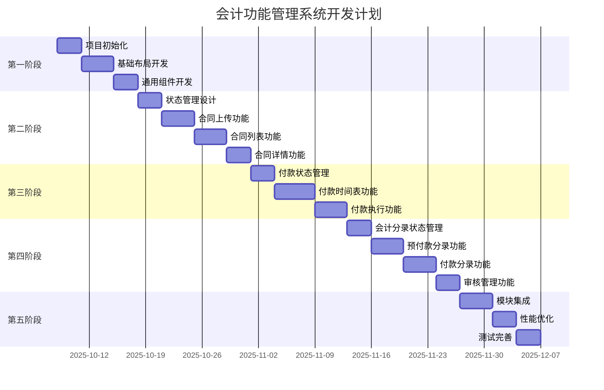

# 开发计划

## 项目开发阶段

### 阶段划分原则
- **渐进式开发** - 从基础功能到高级功能逐步实现
- **模块化实施** - 每个阶段完成一个完整的功能模块
- **可测试性** - 每个阶段都有明确的验收标准
- **风险控制** - 优先实现核心功能，降低项目风险

## 第一阶段：项目基础搭建 (1-2周)

### 目标
建立项目基础架构，完成开发环境配置和基础组件开发。

### 主要任务

#### 1.1 项目初始化 (2-3天)
- **创建项目** - 使用 Vite + React + TypeScript 模板
- **依赖安装** - 安装 Ant Design、React Router、Zustand 等核心依赖
- **项目配置** - 配置 ESLint、Prettier、TypeScript 等开发工具
- **目录结构** - 按照设计文档创建标准目录结构

```bash
# 项目初始化命令
npm create vite@latest accounting-system -- --template react-ts
cd accounting-system
npm install antd react-router-dom zustand
npm install -D @types/node
```

#### 1.2 基础布局开发 (3-4天)
- **AppLayout 组件** - 实现应用主布局
- **AppHeader 组件** - 实现顶部导航栏
- **路由配置** - 配置 React Router，实现 PageA 和 PageB 的路由
- **主题配置** - 配置 Ant Design 主题，设置米色背景和品牌色

**验收标准**
- [ ] 页面显示正确的布局结构
- [ ] Header 显示 "OCBC" 品牌标识
- [ ] 路由切换正常工作
- [ ] 主题色彩符合设计要求

#### 1.3 通用组件开发 (2-3天)
- **LoadingWrapper** - 加载状态包装组件
- **EmptyState** - 空状态展示组件
- **ErrorBoundary** - 错误边界组件
- **PageContainer** - 页面容器组件

**验收标准**
- [ ] 所有通用组件功能正常
- [ ] 组件 API 设计合理
- [ ] TypeScript 类型定义完整
- [ ] 组件文档和示例完整

## 第二阶段：合同管理模块 (2-3周)

### 目标
实现完整的合同管理功能，包括上传、列表展示和详情查看。

### 主要任务

#### 2.1 状态管理设计 (2-3天)
- **Contract Store** - 使用 Zustand 创建合同状态管理
- **类型定义** - 定义 Contract 相关的 TypeScript 类型
- **Mock 数据** - 创建模拟数据用于开发和测试

```typescript
// 合同状态管理示例
interface ContractState {
  contracts: Contract[];
  selectedContract: Contract | null;
  loading: boolean;
  // 操作方法
  uploadContract: (file: File) => Promise<void>;
  getContracts: () => Promise<void>;
  selectContract: (id: string) => void;
  deleteContract: (id: string) => Promise<void>;
}
```

#### 2.2 合同上传功能 (3-4天)
- **ContractUploader 组件** - 实现文件上传组件
- **文件验证** - 实现文件类型和大小验证
- **上传处理** - 实现文件上传逻辑（模拟）
- **错误处理** - 实现上传失败的错误处理

**验收标准**
- [ ] 支持拖拽和点击上传
- [ ] 文件类型验证正确（PDF、DOC、DOCX）
- [ ] 文件大小限制生效（10MB）
- [ ] 上传成功/失败提示正常

#### 2.3 合同列表功能 (3-4天)
- **ContractTable 组件** - 实现合同列表表格
- **列表展示** - 显示合同基本信息
- **操作按钮** - 实现查看、下载、删除操作
- **分页功能** - 实现表格分页

**验收标准**
- [ ] 表格正确显示合同数据
- [ ] 分页功能正常工作
- [ ] 操作按钮响应正确
- [ ] 删除确认对话框正常

#### 2.4 合同详情功能 (2-3天)
- **ContractDetail 组件** - 实现合同详情展示
- **模态框展示** - 使用 Modal 组件展示详情
- **详情信息** - 显示合同完整信息
- **操作集成** - 集成生成付款时间表等操作

**验收标准**
- [ ] 详情模态框正确显示
- [ ] 合同信息展示完整
- [ ] 操作按钮功能正常
- [ ] 模态框交互体验良好

## 第三阶段：付款管理模块 (2-3周)

### 目标
实现付款时间表生成和付款执行功能。

### 主要任务

#### 3.1 付款状态管理 (2-3天)
- **Payment Store** - 创建付款相关状态管理
- **时间表生成逻辑** - 实现付款时间表生成算法
- **付款执行逻辑** - 实现付款执行处理

#### 3.2 付款时间表功能 (4-5天)
- **PaymentTimeline 组件** - 实现时间轴展示组件
- **时间表生成** - 根据合同生成付款计划
- **状态展示** - 显示付款状态（待付款、已付款、逾期）
- **交互功能** - 实现付款项目的交互操作

**验收标准**
- [ ] 时间轴正确显示付款计划
- [ ] 付款状态显示准确
- [ ] 时间表生成逻辑正确
- [ ] 交互操作响应正常

#### 3.3 付款执行功能 (3-4天)
- **PaymentExecution 组件** - 实现付款执行界面
- **付款表单** - 实现付款金额和日期输入
- **执行逻辑** - 实现付款执行处理
- **状态更新** - 付款后更新相关状态

**验收标准**
- [ ] 付款表单验证正确
- [ ] 付款执行逻辑正常
- [ ] 状态更新及时准确
- [ ] 用户反馈清晰明确

## 第四阶段：会计分录模块 (2-3周)

### 目标
实现会计分录的生成、管理和审核功能。

### 主要任务

#### 4.1 会计分录状态管理 (2-3天)
- **Entry Store** - 创建会计分录状态管理
- **分录生成规则** - 实现会计分录生成逻辑
- **审核流程** - 实现分录审核状态管理

#### 4.2 预付款分录功能 (3-4天)
- **EntryTable 组件** - 实现会计分录表格
- **分录生成** - 实现预付款分录自动生成
- **分录展示** - 显示借贷方科目和金额
- **分录编辑** - 支持分录的修改和调整

**验收标准**
- [ ] 分录表格显示正确
- [ ] 自动生成逻辑准确
- [ ] 借贷平衡验证正确
- [ ] 编辑功能正常工作

#### 4.3 付款分录功能 (3-4天)
- **付款分录生成** - 付款执行后自动生成分录
- **分录更新** - 实现分录的更新和修正
- **历史记录** - 保存分录的历史版本
- **审核流程** - 实现分录审核工作流

**验收标准**
- [ ] 付款分录自动生成
- [ ] 分录更新逻辑正确
- [ ] 历史记录功能正常
- [ ] 审核流程完整

#### 4.4 审核管理功能 (2-3天)
- **ApprovalProcess 组件** - 实现审核流程展示
- **审核操作** - 实现通过、退回等操作
- **权限控制** - 实现基础的权限验证
- **通知提醒** - 实现审核状态变更提醒

**验收标准**
- [ ] 审核流程显示清晰
- [ ] 审核操作功能正常
- [ ] 权限控制生效
- [ ] 状态变更及时反馈

## 第五阶段：系统集成与优化 (1-2周)

### 目标
完成模块间集成，进行系统优化和测试。

### 主要任务

#### 5.1 模块集成 (3-4天)
- **数据流集成** - 确保模块间数据流转正确
- **状态同步** - 实现跨模块的状态同步
- **事件通信** - 完善模块间的事件通信机制
- **错误处理** - 统一错误处理和用户反馈

#### 5.2 性能优化 (2-3天)
- **代码分割** - 实现路由级别的代码分割
- **组件优化** - 使用 React.memo 等优化组件性能
- **状态优化** - 优化 Zustand store 的性能
- **资源优化** - 优化静态资源加载

#### 5.3 测试完善 (2-3天)
- **单元测试** - 为关键组件编写单元测试
- **集成测试** - 编写模块间集成测试
- **E2E 测试** - 编写端到端测试用例
- **测试覆盖率** - 确保测试覆盖率达到要求

**验收标准**
- [ ] 所有功能模块正常工作
- [ ] 模块间集成无问题
- [ ] 性能指标达到要求
- [ ] 测试覆盖率 > 80%

## 开发资源和时间安排

### 人员配置
- **前端开发工程师** - 2人
- **UI/UX 设计师** - 1人（兼职）
- **测试工程师** - 1人（兼职）
- **项目经理** - 1人（兼职）

### 时间安排


### 里程碑节点
- **第一阶段完成** - 2025-10-18：基础架构搭建完成
- **第二阶段完成** - 2025-11-08：合同管理模块完成
- **第三阶段完成** - 2025-11-29：付款管理模块完成
- **第四阶段完成** - 2025-12-20：会计分录模块完成
- **项目交付** - 2025-12-31：系统集成和优化完成

## 风险控制

### 技术风险
- **Ant Design 版本兼容性** - 使用稳定版本，关注版本更新
- **TypeScript 类型复杂度** - 合理设计类型，避免过度复杂
- **状态管理复杂度** - 合理划分 Store，避免状态混乱

### 进度风险
- **需求变更** - 建立变更控制流程
- **技术难点** - 提前进行技术预研
- **资源不足** - 建立备用资源计划

### 质量风险
- **测试不充分** - 建立完善的测试体系
- **代码质量** - 建立代码审查机制
- **用户体验** - 定期进行用户体验评估

## 交付物清单

### 代码交付物
- [ ] 完整的前端应用代码
- [ ] 组件库和工具函数
- [ ] 测试用例和测试报告
- [ ] 构建和部署脚本

### 文档交付物
- [ ] 产品设计文档（本文档集）
- [ ] API 接口文档
- [ ] 组件使用文档
- [ ] 部署和运维文档
- [ ] 用户操作手册

### 其他交付物
- [ ] 设计稿和原型
- [ ] 测试计划和测试用例
- [ ] 性能测试报告
- [ ] 项目总结报告
