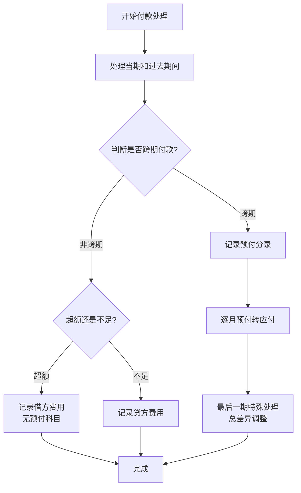

# 付款会计分录生成流程图

## 业务流程图

## 流程说明

### 1. 开始付款处理
- 接收付款请求参数
- 获取选中的摊销期间
- 计算付款金额与预提金额的差异

### 2. 处理当期和过去期间
- 跳过未来期间的处理
- 按会计期间判断是否为未来期间
- 计算剩余付款金额

### 3. 判断是否跨期付款
- **跨期付款**：基于是否有未来期间来判断
- **非跨期付款**：只涉及当期和过去期间

### 4. 非跨期部分处理
#### 超额支付
- 无需增加预付借方会计科目
- 费用调整作为借方费用记录会计分录

#### 不足支付
- 费用调整作为贷方费用记录会计分录

### 5. 跨期部分处理
#### 记录预付分录
- 先记录借方预付
- 按照选中的摊销期间顺序处理

#### 逐月预付转应付
- 借方应付仅使用预摊金额
- 按时间顺序逐月处理

#### 最后一期特殊处理
- **总付款金额大于总预提摊销金额**：剩余金额记入最后一期借方费用，贷方记入最后一期预付
- **不足支付**：记入最后一期贷方费用
- 差异调整集中在最后一期

## 会计分录规则

### 借方科目
- **应付**：对应预提费用
- **预付**：对应未来期间
- **费用**：差异调整

### 贷方科目
- **预付**：逐月转预付
- **活期存款**：实际付款金额
- **费用**：差异调整

### 入账日期规则
- **付款日期晚于应付入账日期**：入账日期为付款日期
- **付款日期早于应付入账日期**：预付以及应付入账日期均为该分录的初始入账日期
- **差异调整**：放到最后一个期间末

## 相关文档
- [API接口文档](./api.md)
- [需求文档](../Requirement_new.md)
